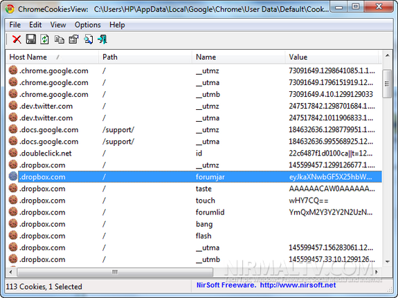

Browser Cookies technically referred to as HTTP Cookies, or more commonly known as simply Cookies, are small pieces of data sent from a website and stored on a user’s computer by the user’s web browser while the user is browsing. Cookies are designed to be a reliable mechanism for websites to remember stateful information, or to record the user’s browser activity[[1](https://https://www.linkedin.com/redir/general-malware-page?url=en%2ewikipedia%2eorg%2Fwiki%2FHTTP_cookie%26nbsp%3B)]. Cookies are very common and your computer likely has hundreds of them right now saved by your browser.

#### So what is a Cookie, exactly?

They are small files of data that normally consist of key-value pairs. The key is the name of the information, and the value being the actual information value. A cookie has a name, this is stored as a Key “Name” and a value of the name of the cookie. For example “User_ID”. The cookie will have content, a key of “Content” and the value is the content of the cookie. In this case, that would be the user ID, for example, a long alphanumeric string (this means numbers and alphabet letters). The cookie will also specify a domain for example “amazon.com", a cookie is normally connected with its source domain in such a way that the information stored in it can only be accessed by the source domain and no other. The cookies also contain a “Send_For” key-value pair that specifies the type of connection (HTTP or HTTPS) that the cookies information can be sent over(used by secure and HTTP-only cookies), and expiration date and time for when the cookie is to be deleted.

#### Session Cookies

Session cookies are the most basic and widely used type of cookie. These are cookies that help to identify you when you log in. HTTP is a “stateless” protocol, which means that the Web Application servers respond to the client requests without linking multiple requests to any one client, for the security and/or functioning of many applications. Many web applications systems and features depend on being able to distinguish between users and to recognize who they are and their permissions/authorization levels. These are problems that are solved by the use of session tokens stored in session cookies. When a user logs in, a web application may choose to use session-based authentication. This is an authentication choice where the server does all the work on its side. When the user logs in they receive a “session_id” which is stored in the form of a cookie on the user’s web browser. When the user makes a subsequent request to the server this “session_id” is sent with the request either as a URL parameter or in the body of a POST request. This id is just used for identification and the server side of the web application the user is using does the rest. Other methods of authentication and authorization I can go into in another post, it’s a great topic with many interesting choices in implementation for developers. Nevertheless, these session cookies expire and are deleted when you close the browser.

#### First-party Cookies

The next type of cookie is the First-Party Cookies. First-party cookies are persistent cookies, they are semi-permanent cookies. These cookies are not deleted when the browser is closed/when the session ends. The cookies are used to store information that is useful to the user, to you. Think - user preferences. When you are on a website and wish to change preferences such as language, light mode/ dark mode, turning notifications on or off, or something else, one of the ways of doing so is with the use of browser cookies. This way, the developer of the website or the company behind the website do not need to persist this data server-side — incurring the cost of extra storage or the general overhead and effort in doing so. This, of course, means that when you log in to your account from another computer you will not have the same preferences and the website will not have the setting you want. But that's the tradeoff in storing this information as a browser cookie — this information stays on the browser it was saved to. First-party cookies are generally set to expire in a year or two. They are long-term cookies, but not permanent — hence when I stated they were “semi-permanent”. First-Party cookies are also used for more long-term kinds of authentication, longer lasting tokens that contain much more information than session cookies (that only identified you and nothing else). First-Party cookies are used in authentication so that you, the user, do not need to re-enter login information every time you visit the page. Handy! These First-Party cookies have to match the domain they came from so they aren’t tracking cookies (remember the Domain key-value pair stored in cookie files). Those are next.

#### Third-party Cookies

These are the scary cookies, the tracking cookies, the potentially privacy-violating cookies. Third party cookies don’t have to originate from the domain you’re currently browsing, so they don’t strictly provide you with any of the benefits of session cookies and first-party cookies. These cookies generally have one purpose, it’s to track you and what you do on the internet. These cookies can log your browsing history (which website you go to, which pages on the websites you go to and so on), your online behavior, demographics, and importantly — your spending habits. If you, the user, buy a product on one website, they are probably logging that information for themselves, and are likely capturing this information and sending it somewhere else (they’ve been paid to do this, and it benefits them). These Third-Party cookies are a favorite with advertising companies.

There are other types of cookies, the big ones are Secure Cookies — that are only received over and sent back over secure connections, HTTP-only cookies, and flash cookies. But for this post, I won’t get into these.

See your Chrome cookies: chrome://settings/siteData?search=cookies

#### General Data Protection Regulation

Most citizens of the EU are aware of the new European Union regulation implemented on the 25th of May 2018 named GDPR. GDPR is an acronym for the General Data Protection Regulation. What is GDPR? It’s, as I said, an EU regulatory legislation that is intended to protect online privacy (something Third-Party Cookies are used to abuse). GDPR requires 4 actions from the website owners who use cookies[[2](https://www.privacypolicies.com/blog/eu-cookie-law/#what-is-the-eu-cookie-legislation)]:

1. When someone visits your website, you need to let them know that your site uses cookies.

2. You need to provide detailed information regarding how that cookie data will be utilized.

3. You need to provide visitors with some means of accepting or refusing the use of cookies in your site.

4. If they refuse, you need to ensure that cookies will not be placed on your machine.

As you can see, the existence and use of cookies by corporations and web applications is a serious privacy issue. The power of browser cookies to invade your privacy for the purpose of data collections and advertising is massive. This is really must-know stuff.

As I've discussed, not all cookies are bad. Session cookies and First-Party cookies are in most use cases essential for the proper functioning of the website. The EU has understood this and made an exception for cookies that are, quote, “strictly necessary” to fulfill the services requested by the site users.

#### How do websites and web applications send and save cookies to your browser

The Internet Engineering Task Force(IETF) released a Request for Comments(RFC) for a Proposed Standard in 2011, RFC6265 entitled “HTTP State Management Mechanism” that describes how this is done using the “Set-Cookie” HTTP header. This header is used to send cookies from the server to the user agent. The RFC describes a list of acceptable grammar for these “set-cookie” response headers, informally they consist of a header name of “Set-Cookie” followed by a colon, and a cookie. To reiterate what a cookie generally is, a cookie begins with a name-value pair, followed by zero or more attribute-value pairs[[3](https://tools.ietf.org/html/rfc6265#section-4.1)]. These headers tell the browser (a browser is just a computer program used to access, render, and interact with websites on remote servers over the internet) to save the cookie to the user's machine.

### Case Study: Facebook

Facebook has a cookie policy where they inform you why they use cookies and what they use the cookie information for. Of course, they may not be telling the absolute truth and maybe omitting details you would deem important and they would deem not important or important to not seem to be important to you. However regardless, this policy is available online at the website. "Facebook use cookies to help us provide, protect, and improve the Facebook Products, such as by personalizing content, tailoring and measuring ads, and providing a safer experience. While the cookies we use may change from time to time as we improve and update the Facebook Products, we use them in the following purposes"[[4](https://www.facebook.com/policies/cookies/)]. I implore you to follow this reference and give it a read, especially if you use a Facebook product (Facebook.com, WhatsApp, Instagram).

#### Facebook Pixel

Facebook Pixel is code that you place on your website that collects and sends to Facebook data that helps Facebook track conversions from Facebook ads, to optimize ads based on your data, and to build targeted audiences for future ad campaigns and to remarket to people who have already taken some kind of action on your website. Facebook Pixel’s tracking data helps ensure a Facebook partners ads are seen by the people are most likely to take your desired action, such as buy your product or go to your blog or subscribe to your Instagram. This allows Facebook partners to improve their Facebook ad money to outcome conversion rate so that they get better ROI or Return On Investment. Facebook defines their “Pixel” as “An analytics tool that allows you to measure the effectiveness of your advertising by understanding the actions that people take on your website.” — Take from that as you will. But with the knowledge of data collection and tracking we’ve previously learned, this is most definitely not a good thing for your privacy. Facebook allows many different ways to target users for advertising. When you pay Facebook a certain amount of money for advertising you are paying for a cash<—>impression transaction. Facebook rewards advertisers for posting relevant ads. If one of Facebook's business partners wants to optimize this transaction they have with Facebook, then they want to target their ads in the most efficient way. This way, they will be charged less per impression if there are positive interactions between the user and the ad such as a click-through, a "like", or a sharing of the ad.

How do people set up a Facebook pixel on their websites? The Facebook Pixel is a small block of code embedded in a web page that passes a Facebook cookie back to Facebook servers. This cookie is used to check if the user is also a Facebook user. Facebook will allow a partner to target advertising to the user associated with that page view on your website. The developer who changes the partner's website code has a very easy copy-paste job in installing this Facebook Pixel code. The developer must locate the HTML header for their website by locating the `<head></head>` tags, locate the header template in their CMS or web platform, and paste the entire Pixel code into the header. That's it. Their website is tracking users information, behavior, and habits and communicating it all back to Facebook.

---