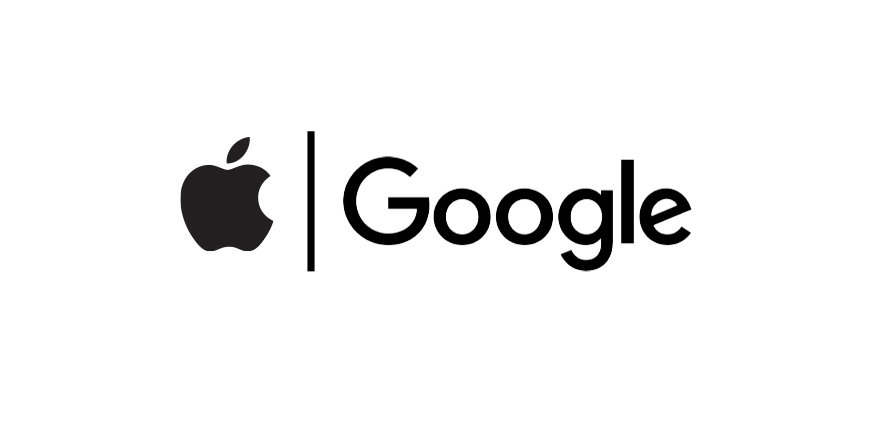
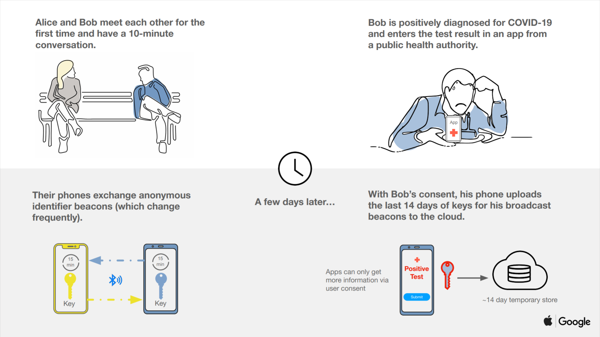
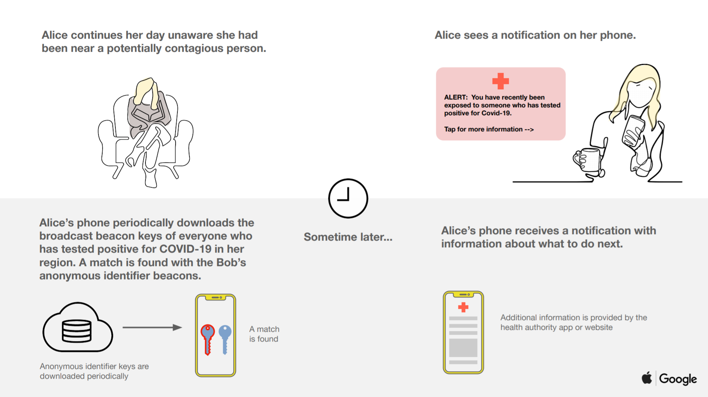

All over the world, health organizations, governments, and non-profit organizations are working hard to combat the threat of the COVID-19 pandemic. Software technologists are looking for ways in which to contribute to the collective effort by harnessing the power of technology.

In Europe, an EU consortium "Pan-European Privacy-Preserving Proximity Tracing" (PEPP-PT), proposed a Decentralized Privacy-Preserving Proximity Tracing (DP3T) system. The white paper[[1](https://github.com/DP-3T/documents/blob/master/DP3T%20White%20Paper.pdf)] for the proposed system was analyzed by École polytechnique fédérale de Lausanne (EPFL) researcher Serge Vaudenay[[2](https://eprint.iacr.org/2020/399.pdf)]. **Vaudenary argues that the DP3T system exposes COVID-19 positive users to deanonymization, and coerces users into revealing private information.**

Are software developers and dominant technology companies like Apple and Google contributing to COVID-19 transmission reduction efforts without laying the infrastructure of surveillance and oppression in the process?

Apple and Google have formed a partnership to leverage Bluetooth Low Energy (BTLE) technology to help governments and health agencies reduce the spread of the virus "with user privacy and security central to the design".[[3](https://www.apple.com/newsroom/2020/04/apple-and-google-partner-on-covid-19-contact-tracing-technology/)]

> "To further [the development of opt-in contact tracing technology], Apple and Google will be launching a comprehensive solution that includes application programming interfaces (APIs) and operating system-level technology to assist in enabling contact tracing. Given the urgent need, the plan is to implement this solution in two steps while maintaining strong protections around user privacy." [[3](https://www.apple.com/newsroom/2020/04/apple-and-google-partner-on-covid-19-contact-tracing-technology/)]

### How does it work?

As part of the joint effort between Apple and Google, the two companies have released draft technical documentation outlining their preliminary plan[[4](https://www.apple.com/covid19/contacttracing/)][[5](ttps://blog.google/inside-google/company-announcements/apple-and-google-partner-covid-19-contact-tracing-technology)]. Here are the diagrams supplied by Google in their press release, followed by technical explanation.

Each device generates a **Tracing Key** (a key that is generated once per device) and securely stores the key on the device. This **Tracing Key** is used to generate a **Daily Tracing Key** every 24 hours. The device will generate a **Rolling Proximity Identifier** from the **Daily Tracing Key** every ~15 minutes, which is broadcast to other nearby Bluetooth-enabled devices via Bluetooth Beaconing.

The device will keep a history of all **Rolling Proximity Identifiers** it has been in range with. When a user has tested positive for COVID-19 the user can consent to send a subset of their **Daily Tracing Keys** for days where the user could have been affected by COVID-19 to a server, this subset of keys is referred to as **Diagnosis Keys**.

Your device periodically downloads all published **Diagnosis Keys** and **Key Derivation Functions** (KDFs[[6](https://en.wikipedia.org/wiki/Key_derivation_function)][[7](https://tools.ietf.org/html/rfc5869)]), each of the clients can re-derive the sequence of **Rolling Proximity Identifiers** that were advertised over Bluetooth from the users who tested positive so that it can match these keys against recorded **Rolling Proximity Identifiers** (the history of devices that your devices have been in proximity with).

The European DP3T system introduced at the beginning of the article added a statement regarding the Apple/Google Proposal. The DP3T team point out that the Apple/Google Proposal is "very similar to our early proposal named 'Low-cost decentralized proximity tracing'", that "[we] strongly believe that Apple and Google should adopt our subsequent enhancements, detailed in later versions of our white paper", and that "We also strongly encourage both companies to allow an external audit of their code to ensure its functionality corresponds to its specification.".

### The solution proposed by Apple and Google raises important questions -

1) **Private until you test positive**

When a user reports positive for COVID-19, their **Diagnosis Keys** (the renamed subset of **Daily Tracing Keys**) are sent to a server and are no longer private to the device. User's BTLE MAC Addresses for days where the user could have been affected by COVID-19 become linkable. This has potential for identification by, for example, Ad Tech[[8](https://blog.hubspot.com/marketing/what-is-ad-tech)].

2) **Size of the _Diagnosis Key_ download.**

Frequently (exact frequency currently unknown), to identify any exposures, each client device will fetch the list of **Diagnosis Keys**. When significant numbers of users report infection this will result in large downloads. For example, assuming your device fetches the **Diagnosis Key** list for your square mile only, if 50% of the population in a square mile of Manhattan(70,826 people [[9](https://worldpopulationreview.com/boroughs/manhattan-population/)]), New York, are positive for COVID-19, the **Diagnosis Key download** will be at minimum 0.6 MB. If the download frequency is daily then this means Contact Tracing downloads of 16 MegaBytes per month. If the download frequency is twice daily, 31 MegaBytes per month. Thrice daily, 48 MegaBytes per month.

Your device will use this list of keys and the HKDF (the function defined to derive the **Rolling Proximity Identifier**) to generate a proximity map of COVID-19 positive device locations so that is can match possible exposure with its location history that has been stored in the form of **Rolling Proximity Identifiers**.

3) **Permanent infrastructure for future tracking & tracing solutions.**

The construction of Application Programming Interfaces (APIs) and operating system-level technology to assist in enabling BTLE contact tracing provides the permanent infrastructure on top of which future use-cases can be supported. Health organizations, governments, and non-profit organizations battling the spread of COVID-19 will be supportive of these measures due to the indisputable value the new contact tracing can bring to flattening infection curves. However this is despite the erosion to privacy and their potential misuse by world governments, government agences, and technology multinationals.

---

References:
1. Decentralized Privacy-Preserving Proximity Tracing (DP3T) system whitepaper (https://github.com/DP-3T/documents/blob/master/DP3T%20White%20Paper.pdf)
2. Analysis of DP3T - Serge Vaudenay (https://eprint.iacr.org/2020/399.pdf)
3. Apple COVID-19 Google Partnership Press Release (https://www.apple.com/newsroom/2020/04/apple-and-google-partner-on-covid-19-contact-tracing-technology/)
4. Apple COVID-19 Contact Tracing Technical Documentation (https://www.apple.com/covid19/contacttracing/)
5. Google COVID-19 Apple Partnership Press Release (https://blog.google/inside-google/company-announcements/apple-and-google-partner-covid-19-contact-tracing-technology)
6. KDF Wiki Article (https://en.wikipedia.org/wiki/Key_derivation_function)
7. HKDF IETF RFC (https://tools.ietf.org/html/rfc5869)
8. HubSpot: What us Ad Tech? (https://blog.hubspot.com/marketing/what-is-ad-tech)
9. Manhattan Population (https://worldpopulationreview.com/boroughs/manhattan-population/)