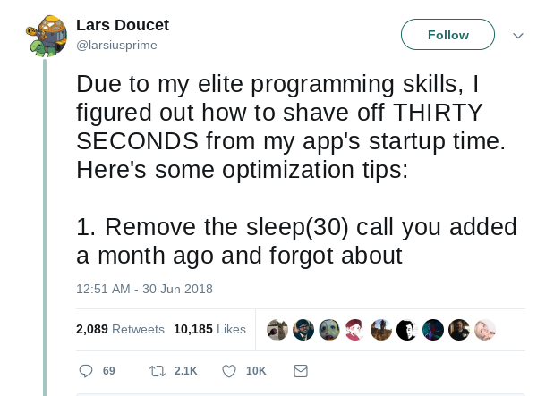
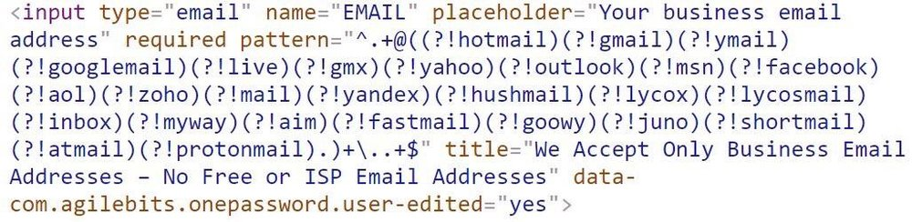

> Thom Holwerda famously entitled a comic illustration as “The only valid measurement of code quality: WTFs/minute.”

Lousy code often derives agitation and sometimes even induces fits of internalized rage in the reader.

The good code may merely evoke the odd WTF here and there.

Which type of code describes what you’re reading when not reading this post?

Unfortunately, a not so insignificant proportion of developers work in software sweatshops. They masquerade as legitimate engineering companies but are marketing companies that leave Research & Development as a sort of an afterthought.

A necessary evil they’re forced to factor into quarterly financial planning.

Short deadlines; long feature lists; too few developers. Non-technically trained management, low salaries, few benefits, old technologies. We can all name a few, and many of us have either spent some time working for one or are working in one right now.

Early-on in a software engineering career, the most critical benefit of your job is personal development.

Personal development never stops being a cornerstone throughout a career, but I can personally attest to its importance in the early stages. Excellent salary, great benefits, convenient location are all worthless if the development environment you’ll be in is not progressing your software development skills.

Why? Receiving the trappings in an environment not optimally conducive to your skills development will stagnate your future career opportunities- therefore future compensation ceiling.

#### What a team gets out of code reviews

A robust code reviewing culture within your team effectively addresses a handful of the most personally significant problems you and your team can experience in a previously sub-optimal engineering environment.

A poorly technically managed organization may experience skill stagnation, silo mentality, developer isolationism, and an absence of dialogue regarding the programming patterns and choices that shape code bases.

Fostering a strong culture of reviewing one another’s code effectively mitigates these significant problems.

Code reviews provide an opportunity to point out mistakes: Typo’s, incorrect formatting, non-descriptive naming, inefficient algorithm choices, incorrect code location placement, and many more.

Reviews provide developers the opportunity to suggest a change. A Pull Request is not only the perfect place to point out mistakes of the submitter, but they are also the ideal place for someone else to ask questions.

Don’t understand something the developer has done? Ask at review time. The combination of correcting mistakes, making suggestions, and asking questions sparks debate and dialogue.

A sense of teamwork, ownership, and collective pride in the product of this process allow teams to function as a unit- not as a collection of independent developers who just so happen to be merging their contributions to a shared project.

#### The current state of many teams

Internally, the consequences of engineering not being the focus of a company appear on the surface as less than ideal developer payroll budget allocation, therefore impacting the headcount of developers. This, coupled with tight product delivery deadlines inundate development teams under a small mountain of planned work and required features by ‘X’ date.

The all too common and entirely incorrect response to this situation by engineering managers is to ‘cut out the fat’ of the day-to-day operations. An often-selected target of this deadline-induced panic? Code reviewing.

“We need to plan, design, and develop features that are deployed to production as soon as possible. Why would we waste time arguing over trivialities that don’t result in tangible, shippable product?” - Thought Management, on the issue of software quality

Aside from being the fictitious internal monologue of a madman, this is an all too regular and all too real occurrence in the companies as mentioned earlier. So, what do you lose? Firstly, your team loses the opportunity for revisionism and hindsight.

Without reviews, team members don’t have a forum for expressing concern regarding chunks of code that are about to be merged with the existing code base, and how they've been implemented.

The steady march forward towards the ultimate goal of a product on maintenance mode continues onward.

If a developer doesn’t have adequate opportunity to express their concern over the code base, then the developer can take no ownership or pride in the collective work of the team.

If the developer takes no ownership or pride in the work of the team than the developer doesn’t care.

If the developer doesn’t care, then your team will produce lousy code.

#### Potential remedies

How can you- a developer, or technical lead push for a stronger code review culture within your team?

You can start by setting pull requests to require approval before merging. More than one approval is optimal to combat a future problem you’ll experience- a pair of developers forming a relationship of code trust and approving each other's pull requests without genuinely reviewing each other’s work.

You can also choose a subset of your engineering team who have “Committer” status. These are members of the team who are generally senior and have a record of shipping quality, clean code.

**“The approver owns the code”** this is an essential mantra for any strong engineering team.

It’s the idea that ultimately the developer who is responsible for merged code is the developer who approved the pull request that introduced it. Not the developer who wrote it.

The pull request approver is the gatekeeper of the master branch; it is their responsibility to ensure that when they approve a pull request that it is up to the required standards.

---
